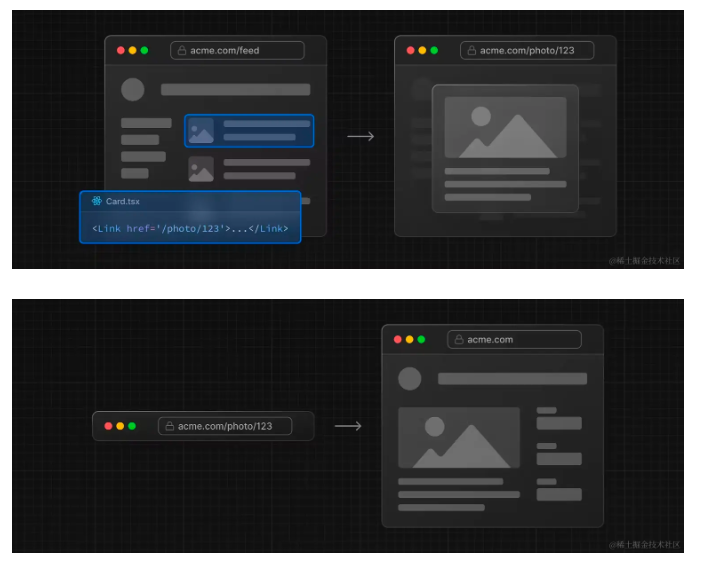
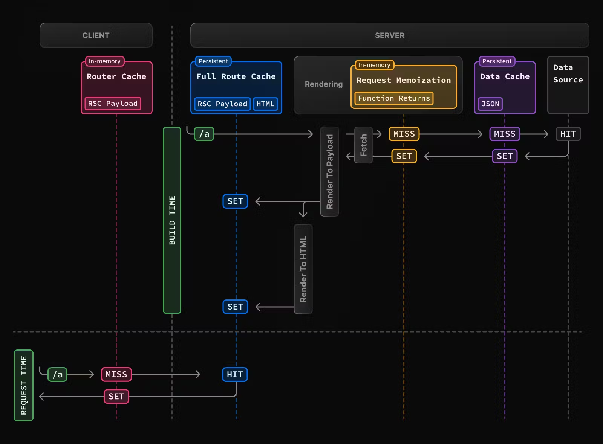

# Rounting 路由
## 文件系统

app 下文件夹，代表 url 路径；
- 如果带括号的文件夹名，则代表 route groups，线路组，不影响 url。
- 如果加下划线，_folderName,则代表 Private Folder，不会被路由系统捕获。

page.tsx: 渲染页，可路由

layout.tsx: 提供一个持久外壳UI，可以用来定义通用结构，切换页面不会remounted

templates.tsx:  也是提供一个外壳UI，也可以用来定义通用结构，但是且路由会 remounted。
> - 可以用来记录 pv，按页反馈表；
> - Suspense 在 layout 里只在首次加载布局时显示 fallback，而对于 template，每次 navigation 时都会显示 fallback。

Metadata: 导出 Metadata 对象，可以修改一些元数据（title、meta）

## link and navigation

Link ：改造版 a 标签

usePathname：获取当前 path

useRouter: 客户端组件中，通过函数，强制跳转。但优先使用 Link 最好。

redirect：服务端组件中，通过函数，跳转导航。例如登录失败，跳转到 login。


> Rounting and Navigation Works，且 性能优化
> 1. 代码分割：next 自动根据路由段，代码分割
> 2. prefetch：Link 组件在视窗可见时，被自动预取；router.prefetch()可以手动开启。
> 3. Router Cache:路由过的内容，会被缓存，尽可能复用。
> 4. 局部渲染：Partial Rendering，layput.tsx能做到。
> 5. 前后导航能保持导航的滚动位置，

## 重定向 redirect

手动重定向：redirect 和 useRouter,NextResponse.redirect in Middleware 

next.config.js,可以直接配置

> Middleware runs after redirects in next.config.js and before rendering.

Next 也提供了[管理大量重定向的解决方案](https://nextjs.org/docs/app/building-your-application/routing/redirecting#managing-redirects-at-scale-advanced)。

## 动态路由 dynamic routes

```tsx
//web/src/app/blog/[id]/page.tsx
export default function BlogIdPage({ params }: { params: { id: string } }) {
    return <div>
        My Blog id: {params.id}
    </div>
}
```

然后就可以访问http://localhost:3000/blog/2

也可以通过 generateStaticParams 生成静态参数，而不是根据 url 动态获取。

## 平行路由 Parallel Routes 和 拦截路由 Intercepting Routes

Parallel Routes：类似 Vue Slots，利用@folderName
Intercepting Routes：

一种实践是，利用 Parallel Routes 和 Intercepting Routes 实现 Modals。

> 如果你在 dribbble.com 想要访问 dribbble.com/shots/xxxxx，此时会拦截 dribbble.com/shots/xxxxx 这个路由地址，以 Modal 的形式展现。而当直接访问 dribbble.com/shots/xxxxx 时，则是原本的样式。
> 

## Route Handlers

通过 route.ts/js，对 API 响应拦截。

## middleware.ts/js

Middleware will be invoked for every route in your project. The following is the execution order:

1. headers from next.config.js
2. redirects from next.config.js
3. Middleware (rewrites, redirects, etc.)
4. beforeFiles (rewrites) from next.config.js
5. Filesystem routes (public/, _next/static/, pages/, app/, etc.)
6. afterFiles (rewrites) from next.config.js
7. Dynamic Routes (/blog/[slug])
8. fallback (rewrites) from next.config.js

https://nextjs.org/docs/app/building-your-application/routing/middleware#matching-paths

# Data Fetching 数据获取

next 扩展了 Fetch API，允许配置 caching（缓存） 和 revalidating（重新验证）行为。

最佳实践是：
- 尽可能在服务器上获取数据，和使用Server Action(服务器操作)来更新数据。

# Caching 缓存

Next 项目在构建过程中有[多处缓存机制](https://nextjs.org/docs/app/building-your-application/caching)（请求结果、组件、数据），会尽可能复用各个阶段的结果


# styling 样式
## CSS modules和 SASS

next 内置支持 xxx.module.css/sass 模块，同时提供了 golbal style 和 外部样式表的导入方式。[参见](https://nextjs.org/docs/app/building-your-application/styling/css-modules)。

## Tailwind CSS
## CSS in JS

# Optimizing 优化

next 提供了多种优化方案：
各类静态资源、bundle 分析、性能指标等
https://nextjs.org/docs/app/building-your-application/optimizing